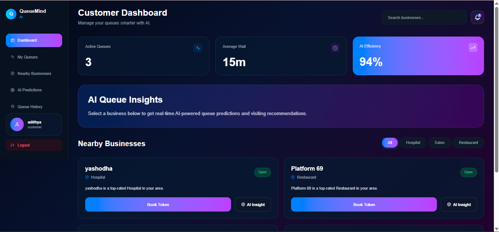
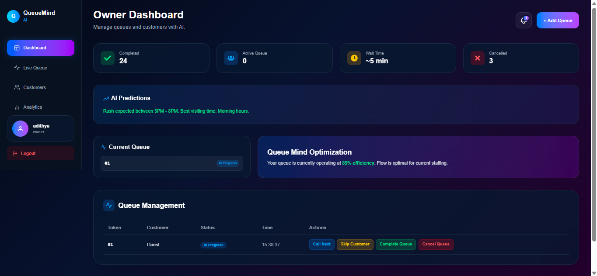
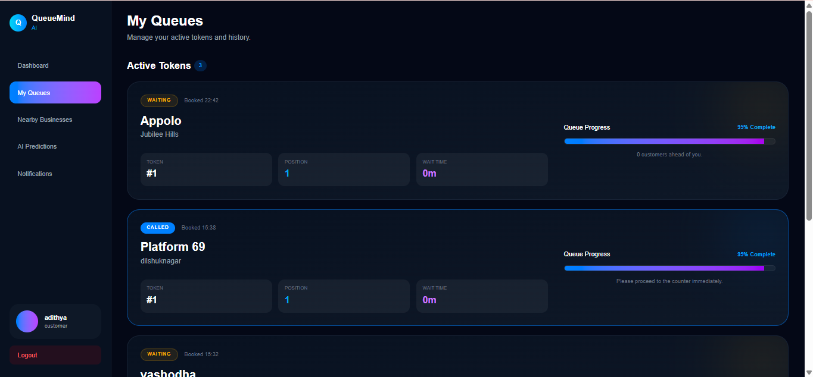

# QueueMind AI 🚀

QueueMind AI is an AI-powered smart queue management platform designed for hospitals, salons, restaurants, and service centers to reduce waiting time and improve customer experience using real-time queue tracking and AI-based predictions.

---

# 🌐 Live Demo

## Frontend
https://queue-mind-ai.vercel.app

## Backend
https://queuemind-ai.onrender.com

---

# 🚀 Key Highlights

- Real-time queue tracking using Socket.io
- AI-based waiting time prediction
- Separate customer and owner dashboards
- Smart queue analytics
- Mobile responsive modern UI
- MERN Stack full-stack application
- Live queue updates
- AI-powered recommendations

---

# ✨ Features

## 👤 Customer Features

- User Authentication
- Browse Nearby Businesses
- Book Queue Tokens
- Live Queue Tracking
- AI Queue Insights
- Queue History
- Real-time Updates
- Business Category Filters

---

## 🏢 Owner Features

- Owner Dashboard
- Add Business
- Manage Queues
- Call Next Customer
- Complete Queue
- Queue Analytics
- AI Predictions
- Live Queue Monitoring

---

## 🤖 AI Features

- Rush Hour Prediction
- Best Visiting Time Suggestions
- Queue Recommendations
- Smart Wait Time Insights
- Queue Trend Analysis

---

# 🛠️ Tech Stack

## Frontend

- React.js
- Vite
- Tailwind CSS
- Axios
- React Router DOM
- Socket.io Client
- React Hot Toast

---

## Backend

- Node.js
- Express.js
- MongoDB Atlas
- Mongoose
- JWT Authentication
- Socket.io
- Gemini AI API

---

# ⚙️ System Workflow

Customer → Books Queue Token → Real-time Queue Updates → Owner Manages Queue → AI Predicts Waiting Time → Customer Receives Insights

---

# 📁 Project Structure

```bash
QueueMind-AI/
│
├── client/              # React Frontend
├── server/              # Express Backend
├── screenshots/         # Project Screenshots
└── README.md
```

---

# 🌐 Deployment

## Frontend
- Vercel

## Backend
- Render

## Database
- MongoDB Atlas

---

# 📸 Screenshots

## Customer Dashboard



---

## Owner Dashboard



---

## Queue Management



---

# ⚙️ Installation

## 1️⃣ Clone Repository

```bash
git clone https://github.com/Sriram-Adithya96/QueueMind-AI.git
```

---

## 2️⃣ Navigate to Project Folder

```bash
cd QueueMind-AI
```

---

## 3️⃣ Install Frontend Dependencies

```bash
cd client
npm install
```

---

## 4️⃣ Install Backend Dependencies

```bash
cd ../server
npm install
```

---

# 🔐 Environment Variables

Create a `.env` file inside the `server` folder.

```env
MONGO_URI=your_mongodb_uri
JWT_SECRET=your_jwt_secret
GEMINI_API_KEY=your_gemini_api_key
PORT=5000
```

---

# ▶️ Run the Application

## Start Backend

```bash
cd server
npm run server
```

---

## Start Frontend

```bash
cd client
npm run dev
```

---

# 🎯 Future Improvements

- Online appointment scheduling
- Payment integration
- Push notifications
- Multi-branch business support
- AI crowd forecasting
- Voice assistant support
- Admin analytics dashboard

---

# 📚 Learning Outcomes

Through this project, I learned:

- Full Stack MERN Development
- REST API Development
- Authentication using JWT
- Real-time communication with Socket.io
- AI API Integration
- Deployment using Vercel & Render
- Responsive UI Design

---

# 👨‍💻 Author

## Sriram Adithya

B.Tech CSE Student  
MERN Stack Developer  
Learning AI & Machine Learning

---

# ⭐ Support

If you like this project, consider giving it a ⭐ on GitHub.
